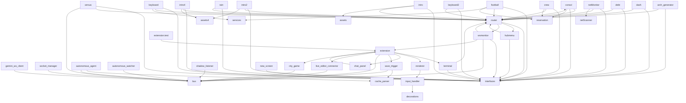

```mermaid
graph TD;
    gemini_ws_client --> bus;
    socket_manager --> bus;
    consol --> router;
    consol --> interfaces;
    consol --> reservation;
    input_handler --> decorations;
    live_editor_connector --> bus;
    autonomous_agent --> cache_parser;
    autonomous_agent --> bus;
    autonomous_watcher --> bus;
    city_game --> bus;
    netMonitor --> interfaces;
    netMonitor --> router;
    netMonitor --> netScanner;
    router --> interfaces;
    router --> hubmenu;
    router --> consol;
    router --> wsmonitor;
    terminal --> router;
    terminal --> interfaces;
    save_trigger --> cache_parser;
    save_trigger --> bus;
    shadow_listener --> bus;
    extension --> terminal;
    extension --> renderer;
    extension --> chat_panel;
    extension --> save_trigger;
    extension --> bus;
    extension --> live_editor_connector;
    extension --> city_game;
    arch_generator --> interfaces;
    arch_generator --> router;
    crew --> interfaces;
    crew --> router;
    crew --> reservation;
    dash --> interfaces;
    dash --> router;
    debt --> interfaces;
    debt --> router;
    football --> interfaces;
    football --> router;
    football --> reservation;
    football --> services;
    hubmenu --> interfaces;
    hubmenu --> router;
    intro --> interfaces;
    intro --> router;
    intro --> assets;
    intro2 --> interfaces;
    intro2 --> router;
    intro2 --> assets4;
    intro4 --> interfaces;
    intro4 --> router;
    intro4 --> assets4;
    keyboard --> interfaces;
    keyboard --> router;
    keyboard --> services;
    keyboard2 --> interfaces;
    keyboard2 --> router;
    new_screen --> interfaces;
    rain --> interfaces;
    rain --> router;
    versus --> interfaces;
    versus --> router;
    versus --> bus;
    wsmonitor --> interfaces;
    wsmonitor --> router;
    wsmonitor --> bus;
    wsmonitor --> extension;
    extension.test --> extension;
    chat_panel --> extension;
    renderer --> input_handler;
```
