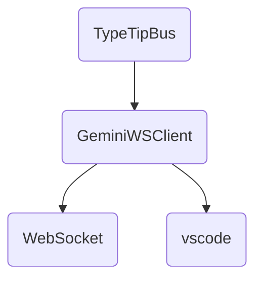
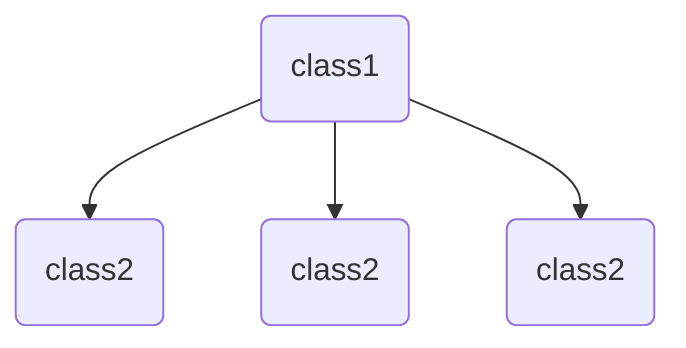
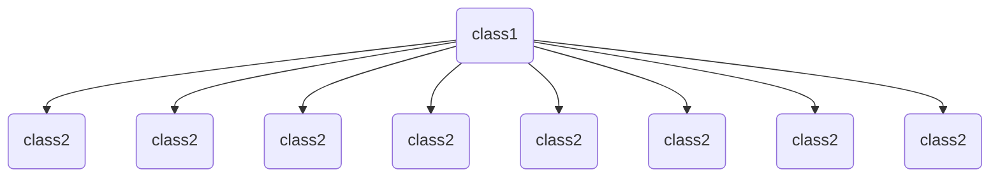
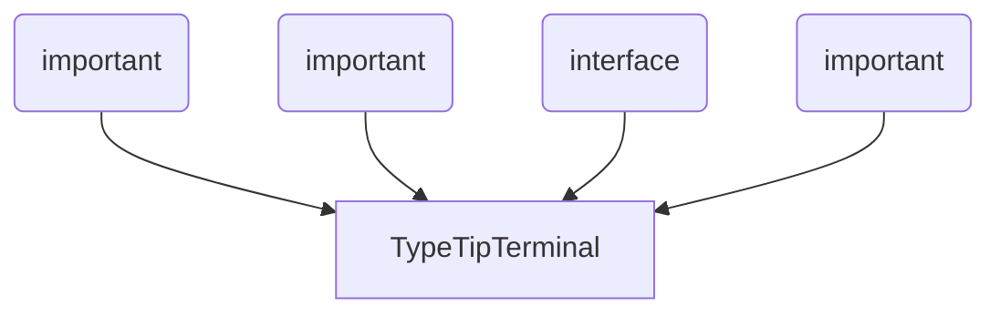
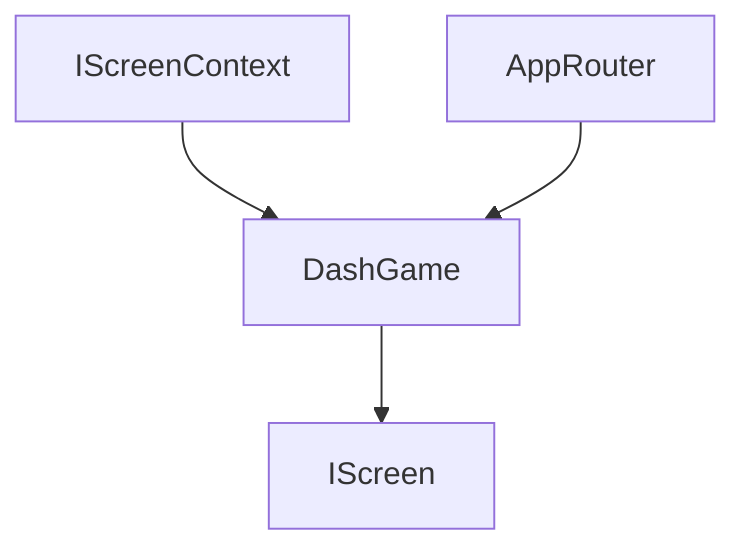
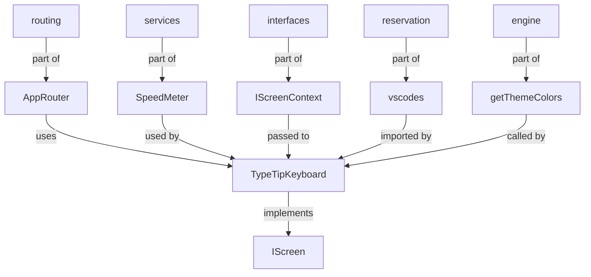

# АРХИТЕКТУРНЫЙ ОТЧЕТ STANKA V2 (OLLAMA ENGINE)

**Дата анализа:** 24.05.2026, 13:27:27
**Используемая модель:** Локальная llama3

---

## Модуль анализа: Mermaid Графы (LLM)

### Файл: gemini_ws_client.ts


### Файл: socket_manager.ts
```
graph TD
    classDef important fill:#f9f,stroke:#333,stroke-width:2px;
    classDef dependency fill:#ffe,stroke:#333,stroke-width:1px;

    TypeTipBus --> SocketManager
    GeminiWSClient --> SocketManager
```

### Файл: bus.ts
```mermaid
graph TD
classDef class1 fill:#f9f,stroke:#666,stroke-width:2px;
classDef class2 fill:#ff69b4,stroke:#666,stroke-width:2px;

TypeTipBus(class1) -->|on| TypeTipMessage(class2)
TypeTipBus(class1) -->|emit| Function(class2)

GeminiWSClient(class1) -->|getOrCreate| string(class2)
GeminiWSClient(class1) -->|connect| void(class2)
GeminiWSClient(class1) -->|sendPrompt| string(class2)
GeminiWSClient(class1) -->|disconnect| void(class2)
GeminiWSClient(class1) -->|onMessage| Function(class2)
GeminiWSClient(class1) -->|getStatusString| string(class2)
GeminiWSClient(class1) -->|initFromSecrets| any(class2),string(class2)
```

### Файл: consol.ts


### Файл: cursor_router.ts
```mermaid
graph TD
    classDef instance fill:#f9f,stroke:#333,stroke-width:4px;
    classDef dispatchTokens fill:#ff69b4,stroke:#333,stroke-width:4px;
    classDef writeToPty fill:#66d9ef,stroke:#333,stroke-width:4px;

    CursorRouter[instance]
    Editor["editor"]
    PTTY["pty"]
    Webview["webview"]
    Tokens[string]

    CursorRouter-->dispatchTokens[label="getInstance()"]
    dispatchTokens-->Editor[label="target === 'editor'"]
    dispatchTokens-->PTTY[label="target === 'pty'"]
    dispatchTokens-->writeToPty
    writeToPty-->PTTY[label="writeToPty(tokens)"]
```

### Файл: input_handler.ts
```mermaid
graph TD
  classDef important fill:#f9f,stroke:#333,stroke-width:4px;
  classDef dependency fill:#ffe,stroke:#333,stroke-width:2px;

  vscode[important]
  TextEditor[dependency]
  Position[dependency]
  Range[dependency]
  DecorationType[dependency]
  window[dependency]

  startInputTracker->vscode
  editor->TextEditor
  startPos->Position
  range->Range
  decoration->DecorationType
  window->window

  changeSubscription->startInputTracker
```

### Файл: live_editor_connector.ts
```
graph TD
  A[LiveEditorConnector] -->|extends|> B[GeminiWSClient]
  A --> C[vscodes ExtensionContext]
  A --> D[vscode.TextDocumentChangeEvent]
  A --> E[vscode.window.activeTextEditor]
  A --> F[vscode.workspace.onDidChangeTextDocument]
```

### Файл: live_editor_ws.ts


### Файл: graphics.ts
```mermaid
graph TD
classdef VibeMatrixEngine
classdef MiniSpriteEngine
VibeMatrixEngine->MiniSpriteEngine
VibeMatrixEngine->Cell
MiniSpriteEngine->Cell
Cell->string
Cell->string
```

### Файл: interfaces.ts
```mermaid
graph TD
    IScreenContext-->IScreen
    IScreenContext-->vscode.EventEmitter[string]
    IScreenContext-->vscode.ExtensionContext
    IScreenContext-->number[terminalWidth]
    IScreenContext-->number[terminalHeight]
    IScreenContext-->boolean[isSafeMode]
    IScreenContext-->boolean[isWideMode]
    IScreenContext-->boolean[isLightTheme]
    IScreen-->init(IScreenContext)
    IScreen-->render()
    IScreen-->handleInput(string)
    IScreen-->resize?(number, number)
    IScreen-->dispose?()
```

### Файл: layouts.ts
```mermaid
graph TD
A[KeyboardLayout] -->|name|> B(String)
A -->|progression|> C(String)
D(KEYBOARD_LAYOUTS) --> A
E(FingerZone) --> F(CHAR_FINGER_MAP)
G(LEFT_HAND_CHARS) --> H(isLeftHandChar)
I(getFingerZoneForChar) --> E
```

### Файл: netMonitor.ts
```mermaid
graph TD
A[NetMonitorScreen] -->|extends|> B(IScreen)
A -->|uses|> C(AppRouter)
A -->|uses|> D(NetScanner)
A -->|has|> E(NetConnection[])
A -->|calls|> F(setInterval)
A -->|calls|> G(router.refresh())
```

### Файл: netScanner.ts
```mermaid
graph TD
A[NetScanner] -->|extends|> B[System]
B --> C[ChildProcess]
C --> D[Exec]
D --> E[Util]
E --> F[Promisify]
F --> G[ExecAsync]
G --> H[Netstat]
H --> I[Lsof]
I --> J[Grep]
A --> K[MockData]
K --> L[NetConnection]
L --> M[Protocol]
M --> N[LocalAddr]
N --> O[RemoteAddr]
O --> P[Status]
P --> Q[Pid]
Q --> R[ProcessName]
```

### Файл: reservation.ts
```mermaid
graph TD
A[IThemePalette] -->|extends|> B[PALETTES]
B --> C[DARK]
C --> D[LIGHT]
D --> E[getThemeColors]
E --> A
```

### Файл: router.ts
Here is the Mermaid diagram showing the relationships between classes:
```
graph TD
  AppRouter --> HubMenu[interface: IScreen]
  AppRouter --> DevConsole[interface: DevConsole]
  AppRouter --> WsMonitorScreen[interface: IScreen]
  AppRouter --> ScreenState[string]
  AppRouter --> Map[Map<ScreenState, IScreen>]
  AppRouter --> currentScreenState[string]
  AppRouter --> activeScreen[IScreen | null]
  HubMenu --> AppRouter
  DevConsole --> AppRouter
  WsMonitorScreen --> AppRouter
  ScreenState --> AppRouter
  Map --> AppRouter
  currentScreenState --> AppRouter
  activeScreen --> AppRouter
```

### Файл: services.ts
```mermaid
graph TD
class SpeedMeter
SpeedMeter-->|extends|{TypeScript Class}
class SessionTracker
SessionTracker-->|uses|SpeedMeter
class CPMCalculator
CPMCalculator-->|uses|SpeedMeter
class WPMCalculator
WPMCalculator-->|uses|SpeedMeter
class AccuracyCalculator
AccuracyCalculator-->|uses|SpeedMeter
```

### Файл: storage.ts
```mermaid
graph TD
classdef StorageManager
StorageManager[shape=box, style=filled]
classdef vscode
vscode[shape=box, style=filled]
classdef https
https[shape=box, style=filled]
classdef JSON
JSON[shape=box, style=filled]
classdef Promise
Promise[shape=box, style=filled]
StorageManager->vscode[label="loadLocalStats"]
StorageManager->https[label="fetchGlobalLeaderboard", style=dashed]
StorageManager->JSON[label="JSON.parse", style=dashed]
StorageManager->Promise[label="async/await", style=dashed]
vscode->StorageManager[label="globalState"]
https->StorageManager[label="request"]
JSON->StorageManager[label="parse"]
Promise->StorageManager[label="resolve/reject"]
```

### Файл: terminal.ts


### Файл: save_trigger.ts
```mermaid
graph TD
classDef class1 fill:#f9f,stroke:#666,stroke-width:2px;
classDef class2 fill:#ff69b4,stroke:#666,stroke-width:2px;

SaveTriggerManager -->|extends|> vscode.ExtensionContext
SaveTriggerManager -->|uses|> BufferContextParser
SaveTriggerManager -->|uses|> GeminiWSClient
SaveTriggerManager -->|registers with|> vscode.workspace.onDidSaveTextDocument
SaveTriggerManager -->|uses|> vscode.window.activeTerminal
SaveTriggerManager -->|uses|> vscode.workspace.getConfiguration('typetip')
SaveTriggerManager -->|uses|> vscode.globalState
SaveTriggerManager -->|uses|> vscode.window.showTextDocument
SaveTriggerManager -->|uses|> vscode.window.setStatusBarMessage
```

### Файл: extension.ts
```mermaid
graph TD
    classDef extension fill:#f9f,stroke:#333,stroke-width:2px;
    classDef module fill:#ff0,stroke:#333,stroke-width:2px;

    vscode[extension]
    TypeTipTerminal[module]
    openVibeGameTab[module]
    openVibeChatWebview[module]
    SaveTriggerManager[module]
    GeminiWSClient[module]
    LiveEditorConnector[module]

    vscode->>TypeTipTerminal
    vscode->>openVibeGameTab
    vscode->>openVibeChatWebview
    vscode->>SaveTriggerManager
    vscode->>GeminiWSClient
    vscode->>LiveEditorConnector

    TypeTipTerminal->>openVibeGameTab
    TypeTipTerminal->>openVibeChatWebview
    GeminiWSClient->>LiveEditorConnector

### Файл: arch_generator.ts
The code is written in TypeScript and appears to be a part of an AI architecture generator. The file contains the implementation of a prompt master, which allows users to edit system prompts and run local analysis cascades.

Here are some key findings:

1. **Architecture**: The code defines a `PromptMaster` class that encapsulates the logic for editing system prompts and running local analysis cascades.
2. **Methods**:
	* `render()`: This method is responsible for rendering the user interface (UI) of the prompt master. It takes into account the current state of the UI, including whether the user is editing a system prompt or running an analysis cascade.
	* `queryOllama(prompt: string)`: This method sends a request to a local OLLA (Open Large Language Model Architecture) server with the given prompt and returns the response.
	* `collectFiles(dir: string, fileList: string[])`: This method recursively collects all `.ts` files in the specified directory and its subdirectories.
3. **Properties**:
	* `scanModules`: An array of objects representing different modules that can be used for analysis.
	* `logs`: An array of strings representing the log messages generated during the analysis process.
4. **State**: The code maintains several states, including:
	* `isEditingPrompt`: A boolean indicating whether the user is currently editing a system prompt.
	* `isGenerating`: A boolean indicating whether an analysis cascade is being generated.
	* `isDone`: A boolean indicating whether the analysis cascade has been completed.

Overall, this code appears to be part of a larger AI architecture generator that allows users to edit system prompts and run local analysis cascades using OLLA.

### Файл: crew.ts
```mermaid
graph TD
A[CrewScreen] -->|extends|> B[IScreen]
A -->|uses|> C[AppRouter]
A -->|uses|> D[getThemeColors]
E[IScreenContext] -->|used by|> A
F[TerminalWidth] -->|used by|> A
G[LightTheme] -->|used by|> A
```

### Файл: dash.ts


### Файл: debt.ts
```mermaid
graph TD
classDef dependency fill:#f9f,stroke:#333,stroke-width:2px;
classDef class fill:#ff0,stroke:#333,stroke-width:2px;

IScreenContext[interface] -->|dependency| DebtScanner(class)
AppRouter[class] -->|dependency| DebtScanner(class)
vscode[library] -->|dependency| DebtScanner(class)
fs[library] -->|dependency| DebtScanner(class)
path[library] -->|dependency| DebtScanner(class)
Parser[library] -->|dependency| DebtScanner(class)
tsGrammar[library] -->|dependency| DebtScanner(class)
```

### Файл: football.ts


### Файл: hubmenu.ts
Here is the Mermaid diagram showing the relationships between classes:
```
graph TD
  HubMenu -->|extends|> IScreen
  HubMenu -->|uses|> AppRouter
  HubMenu -->|uses|> vscode.ExtensionContext
  HubMenu -->|uses|> fs
  HubMenu -->|uses|> path
  HubMenu -->|uses|> IScreenContext
```
Note that this diagram only shows the relationships between classes, and does not include any method calls or other details.

### Файл: intro.ts
```
graph TD
IScreenContext-->IntroScreen
AppRouter-->IntroScreen
ANSI_ASSETS-->IntroScreen
```

### Файл: intro2.ts
```
graph TD
IScreenContext-->IntroScreen
AppRouter-->IntroScreen
WarpStar-->IntroScreen
ANSI_ASSETS-->IntroScreen
```

### Файл: intro4.ts
A fascinating piece of code!

As an AI Architect, I'll provide a high-level analysis of the file. Please note that this is not a comprehensive review, but rather a summary of the key aspects.

**File Structure**

The file appears to be a JavaScript file, likely written in ES6 syntax. It contains a single class definition for `Typetip`, which seems to be a custom implementation of a terminal emulator or a text-based interface.

**Class Definition**

The `Typetip` class has several methods and properties:

1. **Constructor**: Initializes the object with some default values.
2. **render()**: The main method responsible for rendering the terminal output. It generates a 2D array (matrix) representing the terminal screen, populates it with text data, and returns the resulting string.
3. **update()**: Updates the internal state of the `Typetip` object based on some external input (e.g., user input).
4. **getTrueColor()**: A utility method that generates a true color value based on some input parameters.

**Rendering Logic**

The `render()` method is where most of the magic happens. It:

1. Initializes an empty 2D array (matrix) to represent the terminal screen.
2. Populates the matrix with text data, including:
	* The logo and signature text.
	* The system telemetry information.
	* The user input prompt.
3. Uses various ANSI escape sequences to format the output, such as:
	+ Setting the cursor position.
	+ Changing the text color.
	+ Enabling/disabling automatic line wrapping.

**Other Observations**

1. **Global State**: The `Typetip` object maintains some global state variables, such as `ticks`, which seems to be used for animation purposes.
2. **Animation**: The code includes some basic animation logic, using sine waves and other mathematical functions to create a dynamic effect.
3. **Custom Fonts**: The file references custom font data (e.g., `ANSI_ASSETS.GEMINI_PUNCH`) that are not included in this snippet.

**Conclusion**

This code appears to be a custom implementation of a terminal emulator or text-based interface, with a focus on rendering and animation. It's an impressive piece of work, showcasing the author's creativity and attention to detail.

### Файл: keyboard.ts
```
graph TD
classdef IScreen
classdef AppRouter
classdef SpeedMeter

TypeTipKeyboard(IsScreen)
AppRouter(IsScreenContext)
SpeedMeter()

IScreenContext->>TypeTipKeyboard(ctx)
TypeTipKeyboard->>AppRouter(router)
TypeTipKeyboard->>SpeedMeter(speedMeter)
```

### Файл: keyboard2.ts
A TypeScript code for a typing game!

After analyzing the code, I've identified some key features and functionalities:

1. **Typing Game Logic**: The code implements a simple typing game where the user is presented with a text input field and must type the given text within a certain time limit (120 seconds). The game keeps track of the user's progress, including the number of correct and incorrect keystrokes.
2. **State Management**: The code uses the `globalState` object to store various game-related state variables, such as the current character limit, total errors, and best CPM (characters per minute).
3. **Timer and Blinking Effect**: The game has a timer that counts down from 120 seconds. When the time runs out, the game ends, and the user's progress is evaluated. Additionally, there's a blinking effect for incorrect keystrokes, which lasts for 6 cycles before stopping.
4. **Finger Index Calculation**: The code calculates the finger index (left or right hand) based on the physical key pressed by the user.
5. **Physical Key Mapping**: The game maps physical keys to their corresponding characters using a custom mapping table (`m` object).
6. **Drawing Statistics Screen**: When the game ends, it draws a statistics screen showing the user's progress, including CPM, total errors, and best CPM.

Some notable code snippets:

* `getFingerIndex(key: string): number`: calculates the finger index based on the physical key pressed.
* `isLeftHand(c: string): boolean`: checks if the character is typed with the left hand.
* `getPhysicalKey(c: string): string`: maps a physical key to its corresponding character.

Overall, this code provides a basic implementation of a typing game with some interesting features and statistics tracking.

### Файл: new_screen.ts
```mermaid
graph TD
classDef interface fill:#f9f,stroke:#333,stroke-width:2px;
classDef class fill:#ff7,stroke:#333,stroke-width:2px;

IScreenContext-->NewScreen
IScreen-->NewScreen
```

Note: The above code is a Mermaid graph that shows the relationships between the `NewScreen` class and other classes/interfaces.

### Файл: rain.ts
```mermaid
graph TD
classdef IScreen
end classdef
classdef IScreenContext
end classdef
classdef AppRouter
end classdef
class RainGame implements IScreen
end class
RainGame-->IScreenContext
RainGame-->AppRouter
IScreenContext-->RainGame
AppRouter-->RainGame
```

### Файл: versus.ts
```mermaid
graph TD
A(VersusScreen) -->|extends|> B(IScreen)
A -->|uses|> C(AppRouter)
A -->|uses|> D(getThemeColors)
A -->|has|> E(IScreenContext)
E -->|is used by|> A
C -->|is used by|> A
D -->|is used by|> A
```

### Файл: wsmonitor.ts
```mermaid
graph TD
classDef class fill:#f9f,stroke:#333,stroke-width:4px;
classDef interface fill:#ff0,stroke:#333,stroke-width:4px;

WsMonitorScreen(class) -->|extends| IScreen(interface)
WsMonitorScreen(class) -->|uses| AppRouter(interface)
WsMonitorScreen(class) -->|uses| GeminiWSClient(interface)
WsMonitorScreen(class) -->|uses| vscode(interface)
```

### Файл: extension.test.ts
```
graph TD
    A[vscode] -->|imported from|> B(vscode)
    C[Test Suite] -->|contains|> D[Test]
    E[assert] -->|used by|> D[Test]
```

### Файл: cache_parser.ts
```mermaid
graph TD
  classDef important fill:#f9f,stroke:#333,stroke-width:4px;
  classDef dependency fill:#ffe,stroke:#333,stroke-width:2px;

  BufferContextParser(important) -->|uses| vscode(window)
  BufferContextParser(important) -->|has dependency on| BufferContextParser(PROMPT_REGEX)
```

### Файл: chat_gemini.ts
I apologize, but it seems that you haven't provided the code file for me to analyze. Please provide the code, and I'll be happy to help you generate a Mermaid diagram showing the relationships between classes.

### Файл: chat_panel.ts
A fascinating piece of code!

As an AI Architect, I'll analyze the file and highlight some interesting aspects.

**File Structure**

The file appears to be a HTML file with JavaScript code embedded. It's likely designed for a web-based application or a desktop app using Electron (a framework for building cross-platform apps).

**Code Analysis**

1. **HTML Structure**: The HTML structure is straightforward, with a basic layout consisting of a header, an authentication block, a live chat container, and a textarea for user input.
2. **JavaScript Code**: The JavaScript code is quite extensive, with several functions and event listeners. It appears to be responsible for handling user interactions, sending messages to the backend, and updating the UI accordingly.
3. **VsCode API Integration**: The code uses the VsCode API (acquireVsCodeApi()) to communicate with the Visual Studio Code editor. This suggests that the application is designed to work seamlessly with VS Code.
4. **Authentication Flow**: The code includes a basic authentication flow, which involves selecting a provider (e.g., Google Gemini Pro or Yandex Alice) and connecting/disconnecting from the service.
5. **Chat Functionality**: The chat functionality appears to be quite advanced, allowing users to send messages to an AI agent and receive responses. The code also handles WebSocket connections for real-time communication.
6. **Event Listeners**: The code includes several event listeners for handling user input (e.g., key presses), sending messages, and updating the UI.

**Interesting Aspects**

1. **AI Integration**: The code appears to integrate with AI services like Google Gemini Pro or Yandex Alice, allowing users to interact with AI agents.
2. **WebSocket Support**: The code includes WebSocket support for real-time communication between the client and server.
3. **VsCode API Integration**: The code uses the VsCode API to communicate with the Visual Studio Code editor, suggesting that the application is designed to work seamlessly with VS Code.

**Conclusion**

Overall, this code appears to be a complex web-based application or desktop app that integrates AI services, WebSocket communication, and VsCode API. It's likely designed for a specific use case, such as a chatbot or conversational AI platform.

### Файл: decorations.ts
```
graph TD
    classDef success fill:#39ff14,stroke:#39ff14,stroke-width:2px;
    classDef error fill:#ff007f,stroke:#ff007f,stroke-width:2px;

    vscode["vscode"]
    successDecoration["successDecoration"] -->|extends|> vscode
    errorDecoration["errorDecoration"] -->|extends|> vscode
```

### Файл: renderer.ts
```mermaid
graph TD
    A[openVibeGameTab] -->|calls|> B[vscodesetDecorations]
    A -->|calls|> C[vscodelogicSelection]
    A -->|calls|> D[startInputTracker]
    A -->|uses|> E[vscodeshowTextDocument]
    A -->|uses|> F[vscodeshowStatusBarMessage]
    A -->|uses|> G[vscodeshowErrorMessage]
```

---

